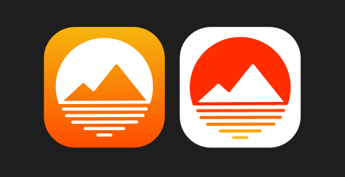

# dsgn270-a3

- **Deoj Balcanao**

- **DSGN 270 Assignment 3 - SVG Logo Design**

## Design Concept
**This is a logo design for a hotel and resort company. I designed it to be simplistic. It can also be used as an app icon.**

## Design Process
- I started the design by creating different shapes and experimenting. I played around with the paths and the lines, and then I came up with an idea of a mountain and sun.
- Now that I got the idea, I created different kinds of mountains and shapes and made different variations.

- I decided to design the logo in a circle format. It makes the logo looks clean and pleasing to the eye.

- The construction of the logo is simple. For the mountain, I use two rectangles and union them, and then I added a circle and use the substract selection.

- I use the negative space as the sky and I rounded the edges just to style it a little bit, and to fit the circle format of the logo.

- I use the pen tool to draw straight lines to create the image of the water.

- And then I came up with the color choice and made this. I went for a vibrant color palette. It gives the logo meaning of sunrise.

## Color Palette

## App Icons
